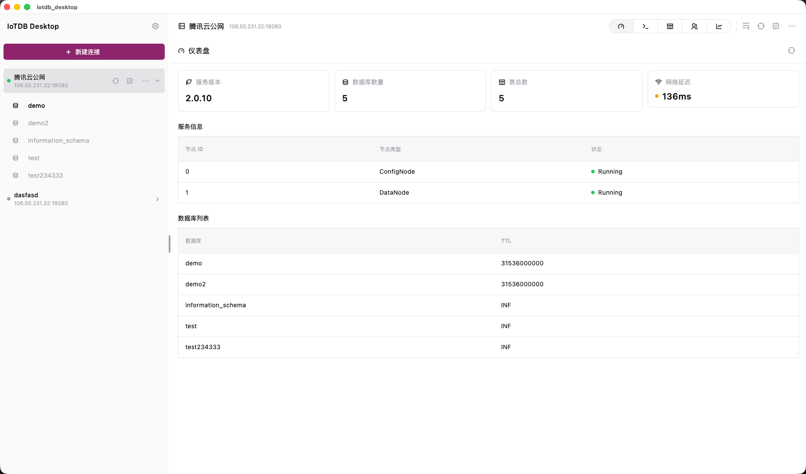
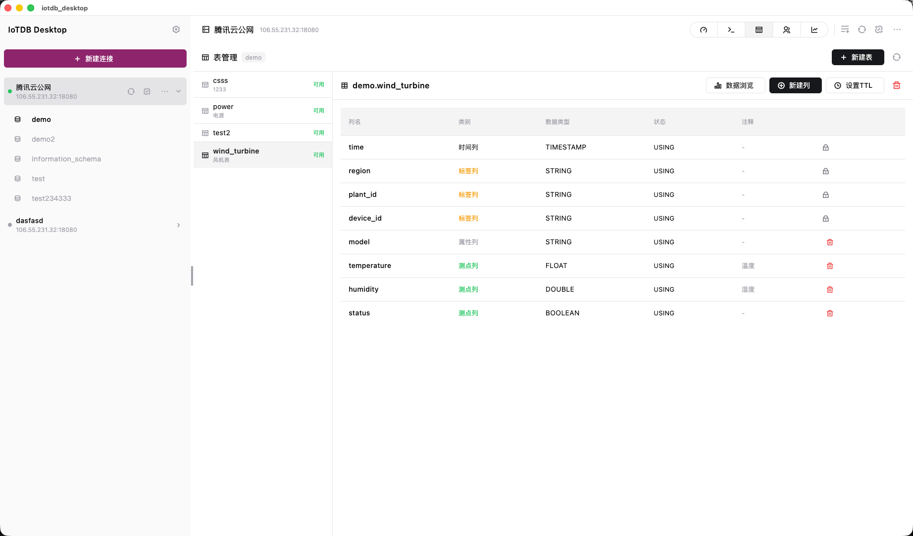
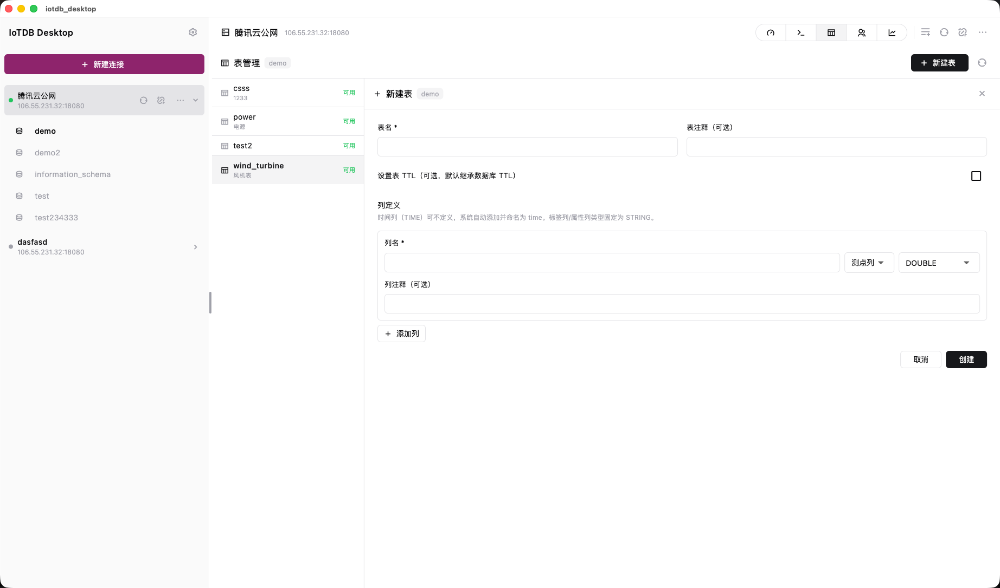
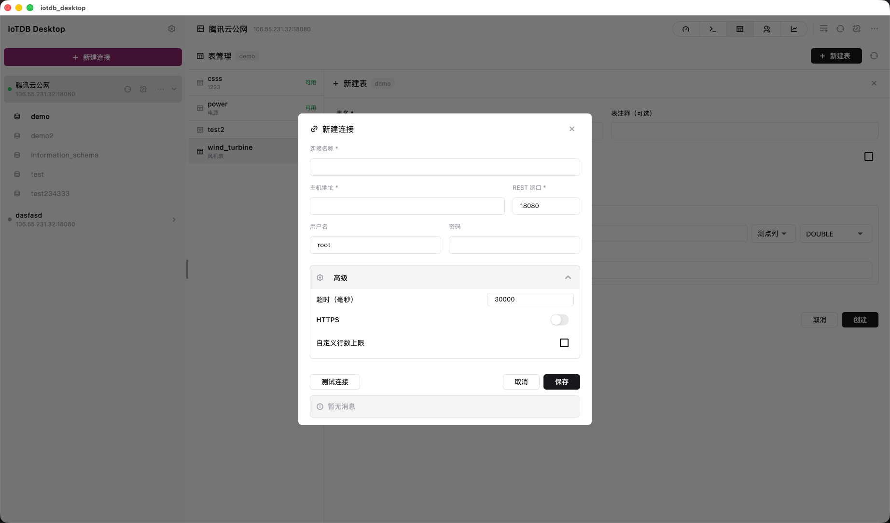
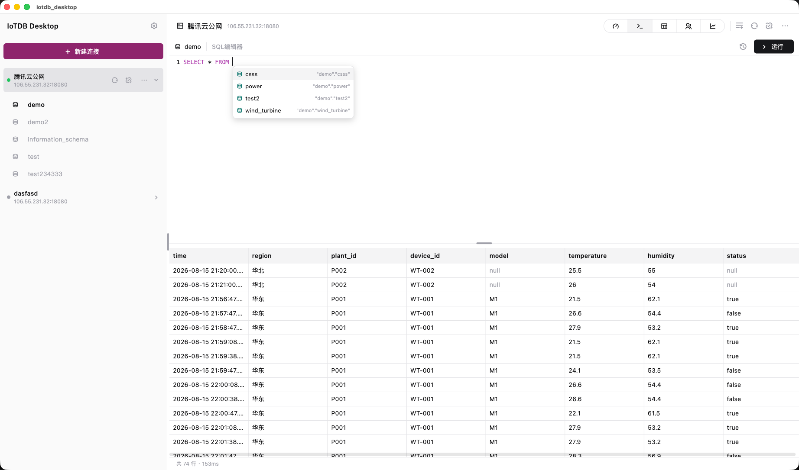
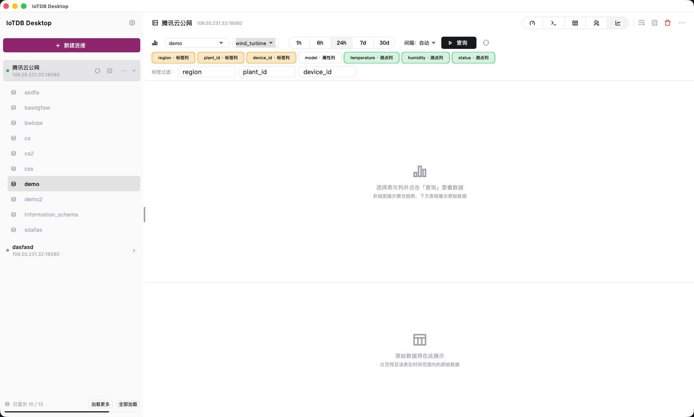

<p align="center">
  
</p>

<h1 align="center">Apache IoTDB 桌面端管理工具</h1>

<p align="center">
  基于 Flutter 构建，支持 macOS / Windows，提供数据库、表、数据、SQL 与权限的一站式可视化运维体验
</p>

<p align="center">
  
  
  
</p>

[Apache IoTDB](https://iotdb.apache.org/) 是 Apache 软件基金会顶级项目，面向物联网场景的高性能时序数据库，支持海量时序数据的高吞吐写入、低延迟查询与高效压缩。本工具是 IoTDB 的桌面管理客户端，通过 IoTDB REST API v2（表模型）与服务器交互，将常用的运维操作图形化、可视化。

> **免责声明**：本工具为社区第三方开发，与 Apache IoTDB 官方项目无关，未获得 Apache 软件基金会及 Apache IoTDB 项目的认可、赞助或背书。Apache IoTDB 及其相关商标归 Apache 软件基金会所有。

## 功能特性

- **连接管理** — 多连接侧边栏，支持新增 / 编辑 / 删除 / 测试连接，ping 检测延迟与状态展示；支持 SSL、请求超时与结果集行数上限配置；密码不写入连接配置文件，经加密存储独立保存
- **仪表盘** — 服务版本、数据库数量、表总数、网络延迟等统计卡片；集群节点列表（节点类型 / 状态 / 主机）；数据库列表（含 TTL）
- **SQL 工作台** — 多标签编辑器，语法高亮，支持多条语句（`;` 拆分）依次执行；自动路由查询类（`query`）与非查询类（`nonQuery`）接口；执行结果分页表格 + 每句耗时展示；执行历史记录可回填复用
- **表管理** — 数据库 → 表 → 列结构三级管理；可视化建表（TIME / TAG / ATTRIBUTE / FIELD 四类列）、新建列、删除列 / 表（带二次确认）；设置数据库或表级 TTL；表与列状态（USING / PRE_CREATE / PRE_DELETE）展示
- **数据浏览** — 选择数据库与表，多选字段 + TAG 过滤 + 时间范围（近 1 小时 / 24 小时 / 7 天 / 自定义），按数据类型自动选择聚合函数生成折线图；原始数据分页浏览（支持上一页 / 下一页 / 跳页）
- **用户与权限** — 用户 / 角色列表与详情查看，新建用户 / 角色，授予或撤销权限（数据库级与系统级）
- **设置** — 浅色 / 深色 / 跟随系统三种主题模式；侧边栏宽度拖拽调节并可重置

## 运行效果

<div align="center">

| 连接管理 | 仪表盘 |
| --- | --- |
|  |  |

| SQL 工作台 | 表管理 |
| --- | --- |
|  |  |

| SQL 工作台 | 数据图表 |
| --- | --- |
|  |  |

</div>

## 技术栈

| 类别 | 技术 |
| --- | --- |
| 框架 | Flutter（Dart SDK ^3.10） |
| 状态管理 | flutter_riverpod |
| 网络 | dio（HTTP 客户端，Basic Auth 认证） |
| 图表 | fl_chart（聚合折线图） |
| 编辑器 | re_editor + re_highlight（SQL 语法高亮） |
| 图标 | remixicon |
| 其他 | path_provider、uuid、intl |

## 环境要求

- Flutter SDK（>= 3.x，Dart >= 3.10）
- macOS 或 Windows 系统
- IoTDB 2.x 服务端，并已开启 REST 服务（配置 `enable_rest_service=true`，详见[官方文档](https://iotdb.apache.org/UserGuide/latest/Reference/RestService.html)）；默认 REST 端口为 `18080`

## 快速开始

```bash
# 安装依赖
flutter pub get

# 运行（桌面端）
flutter run -d macos    # macOS
flutter run -d windows  # Windows
```

运行后：

1. 点击侧边栏「新增连接」，填写名称、主机、端口（默认 `18080`）、用户名与密码
2. 点击「测试连接」验证连通性（可显示服务端版本与延迟）
3. 打开连接，展开左侧数据库列表进入工作区

## 测试

项目内置完整的单元 / Widget / 存储测试，测试不发起真实网络请求（使用内置 Fake 客户端按 SQL 注入返回数据）：

```bash
# 静态检查
flutter analyze

# 运行全部测试
flutter test

# 运行单个测试文件
flutter test test/unit/sql_builder_test.dart
```

## 项目结构

```
lib/
├── main.dart                 # 应用入口
├── app.dart                  # 根组件（主题 + HomeShell）
├── core/                     # 核心层
│   ├── models/               # 数据模型（连接 / 查询结果 / 表元数据）
│   ├── network/              # IoTDB REST 客户端、SQL 语句路由
│   ├── providers.dart        # Riverpod 全局 Provider
│   ├── storage/              # 连接 / 设置持久化、安全存储
│   ├── theme/                # 主题与设计令牌（shadcn 风格）
│   └── utils/                # SQL 构建器等工具
├── features/                 # 功能模块（按页面划分）
│   ├── connections/          # 连接管理（侧边栏 / 表单）
│   ├── dashboard/            # 仪表盘
│   ├── sql/                  # SQL 工作台
│   ├── database/             # 表管理（建表 / 列 / TTL）
│   ├── data/                 # 数据浏览（图表 + 原始数据）
│   ├── users/                # 用户与权限
│   ├── home/                 # 应用外壳（布局与导航）
│   └── settings/             # 设置
├── shared/                   # 公共组件（确认对话框 / 空状态 / 结果表格）
└── assets/
    ├── logo.png              # 应用 Logo
    └── logo_dock.png         # Dock / README Logo
```

## 相关链接

- [Apache IoTDB 官网](https://iotdb.apache.org/)
- [IoTDB 官方文档](https://iotdb.apache.org/UserGuide/latest/)
- [REST Service 使用指南](https://iotdb.apache.org/UserGuide/latest/Reference/RestService.html)
- [Apache IoTDB GitHub](https://github.com/apache/iotdb)

## License

Apache License 2.0
